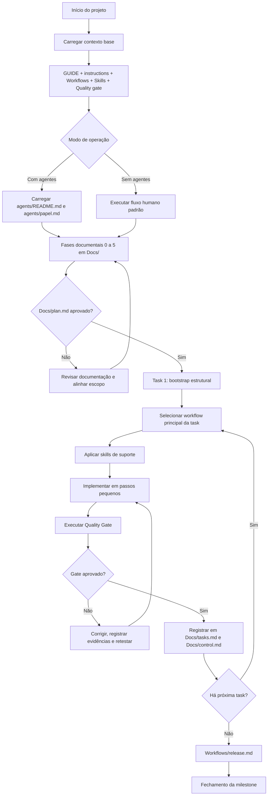

# GUIDE

> Guia metodológico oficial do Nébula Spec Kit.

---

## Objetivo

Organizar a construção de um projeto em fases sequenciais para reduzir ambiguidade e aumentar a previsibilidade de execução.

---

## Princípio Operacional

```
Analisar → Revisar → Mapear → Planejar → Comparar → Implementar → Testar → Validar
```

---

## Fluxo de Uso do Nébula (Mermaid)



Notas:
- `Manual/` é guia para dev humano e não integra o contexto mínimo de IA.
- `Templates/` é referência de estrutura; saída oficial sempre em `Docs/`.

---

## Regras Canônicas

### Artefatos

- Arquivos em `Templates/` são modelos de preenchimento — nunca saída oficial
- Artefatos oficiais do projeto devem ser salvos em `Docs/`
- Protótipos HTML devem ser salvos em `Docs/Prototype/`

### Início da Documentação

- A pasta `Docs/` inicia vazia por projeto
- O fluxo consiste em editar progressivamente os arquivos de `Docs/` usando `Templates/` como modelo
- Implementação ou refatoração só inicia após a documentação mínima da demanda estar consistente

---

## Fases do Projeto

### Fase 0 — Descoberta

Captura o contexto, motivação e escopo do projeto antes de qualquer decisão técnica.

| Papel         | Arquivo                                            |
|---------------|----------------------------------------------------|
| Modelo        | [Templates/Full/brief.md](Templates/Full/brief.md) |
| Saída oficial | [Docs/brief.md](Docs/brief.md)                     |

### Fase 1 — Definição do Projeto

Define o produto, objetivos, restrições e escolhas de stack.

| Papel         | Arquivo                                            |
|---------------|----------------------------------------------------|
| Modelos        | [Templates/Full/project.md](Templates/Full/project.md) · [Templates/Full/stack.md](Templates/Full/stack.md) |
| Saídas oficiais | [Docs/project.md](Docs/project.md) · [Docs/stack.md](Docs/stack.md) |

### Fase 2 — Requisitos Funcionais

Mapeia comportamentos esperados do sistema na perspectiva do usuário.

| Papel         | Arquivo                                            |
|---------------|----------------------------------------------------|
| Modelo        | [Templates/Full/user-stories.md](Templates/Full/user-stories.md) |
| Saída oficial | [Docs/user-stories.md](Docs/user-stories.md) |

### Fase 3 — Design de Produto

Define a experiência visual, navegação e sistema de design da interface.

| Papel         | Arquivo                                            |
|---------------|----------------------------------------------------|
| Modelos        | [Templates/Full/pages.md](Templates/Full/pages.md) · [Templates/Full/flow.md](Templates/Full/flow.md) · [Templates/Full/design-system.md](Templates/Full/design-system.md) · [Templates/Full/tokens.json](Templates/Full/tokens.json) |
| Saídas oficiais | [Docs/pages.md](Docs/pages.md) · [Docs/flow.md](Docs/flow.md) · [Docs/design-system.md](Docs/design-system.md) · [Docs/tokens.json](Docs/tokens.json) |
| Protótipos | [Docs/Prototype/README.md](Docs/Prototype/README.md) |

### Fase 4 — Design de Sistema

Define entidades, arquitetura, contratos de API, estrutura de código e estratégia de deploy.

| Papel         | Arquivo                                            |
|---------------|----------------------------------------------------|
| Modelos        | [Templates/Full/entities.md](Templates/Full/entities.md) · [Templates/Full/architecture.md](Templates/Full/architecture.md) · [Templates/Full/contract.yaml](Templates/Full/contract.yaml) · [Templates/Full/structure.md](Templates/Full/structure.md) · [Templates/Full/deploy.md](Templates/Full/deploy.md) |
| Saídas oficiais | [Docs/entities.md](Docs/entities.md) · [Docs/architecture.md](Docs/architecture.md) · [Docs/contract.yaml](Docs/contract.yaml) · [Docs/structure.md](Docs/structure.md) · [Docs/deploy.md](Docs/deploy.md) |

### Fase 5 — Planejamento de Implementação

Estrutura o plano de execução, tasks e controle de progresso.

| Papel         | Arquivo                                            |
|---------------|----------------------------------------------------|
| Modelos        | [Templates/Full/plan.md](Templates/Full/plan.md) · [Templates/Full/tasks.md](Templates/Full/tasks.md) · [Templates/Full/control.md](Templates/Full/control.md) |
| Saídas oficiais | [Docs/plan.md](Docs/plan.md) · [Docs/tasks.md](Docs/tasks.md) · [Docs/control.md](Docs/control.md) |

---

## Mapeamento de Fases de Execução

As fases documentais acima se traduzem em quatro fases de execução no `plan/tasks`:

| Fase | Escopo |
|---|---|
| **FASE-01** | Consolidação documental inicial (Fase 0 → Fase 3) |
| **FASE-02** | Modelagem técnica e preparo de execução (Fase 4 + plano detalhado) |
| **FASE-03** | Implementação ou refatoração por tasks com validações intermediárias |
| **FASE-04** | Estabilização final, Quality Gate e fechamento de milestone |

---

## Política de Execução por Task

### Marco obrigatório de início

- A primeira task deve ser de **bootstrap estrutural**
- A task de bootstrap cria todos os diretórios e arquivos previstos
- A partir da task seguinte, o fluxo opera apenas em modo edição

### Regras por task

- Cada task concluída gera exatamente **1 commit**
- Apenas tasks com política `bootstrap_estrutural` podem criar diretórios e arquivos
- Tasks com política `edição` não podem criar novos caminhos
- Se um arquivo esperado não existir durante task de edição, abrir **task de ajuste estrutural**
- Toda task deve registrar hash do commit e arquivos tocados em [Docs/tasks.md](Docs/tasks.md)
- Toda task deve registrar status do Quality Gate e evidências mínimas de validação

---

## Dependências Recomendadas

Ordem de consistência entre artefatos:

- `Docs/contract.yaml` depende de `Docs/entities.md` e `Docs/architecture.md`
- `Docs/tasks.md` depende de `Docs/plan.md`
- `Docs/tokens.json` depende de `Docs/design-system.md`
- `Docs/design-system.md` depende de referência validada em `Docs/Prototype/`, quando houver interface
- Nenhuma task pode ser concluída sem passar no Quality Gate de [Quality/validation-rules.md](Quality/validation-rules.md)

---

## Regra de Precedência

Em caso de conflito entre fontes, a ordem de autoridade é:

1. `instructions.md` (raiz operacional)
2. `Docs/contract.yaml` (contrato vigente)
3. Documento-fonte do domínio em `Docs/`
4. `Docs/plan.md` e `Docs/tasks.md`
5. Workflow principal em `Workflows/*.md`
6. `Quality/validation-rules.md` + regras de qualidade aplicáveis
7. Implementação atual

Esta seção espelha a precedência canônica definida em `instructions.md`.

---

## Pilares Transversais

### Qualidade

| Arquivo | Conteúdo |
|---|---|
| [Quality/README.md](Quality/README.md) | Visão geral do pilar |
| [Quality/validation-rules.md](Quality/validation-rules.md) | Gate obrigatório por task |
| [Quality/realistic-tests.md](Quality/realistic-tests.md) | Testes realistas |
| [Quality/anti-mock.md](Quality/anti-mock.md) | Política anti-mock |
| [Quality/clean-rules.md](Quality/clean-rules.md) | Regras de código limpo |
| [Quality/structure-rules.md](Quality/structure-rules.md) | Regras estruturais de arquivo e módulo |
| [Quality/metrics.md](Quality/metrics.md) | Métricas e bandas de risco |
| [Quality/review-checklist.md](Quality/review-checklist.md) | Checklist de revisão |
| [Quality/dependencies.md](Quality/dependencies.md) | Dependências e compatibilidade |
| [Quality/execution-policy.md](Quality/execution-policy.md) | Execução por task e controle de escopo |

### Manual Operacional

| Categoria | Arquivos |
|---|---|
| Navegação | [Manual/README.md](Manual/README.md) |
| Execução | [Manual/17EXECUTION-BASELINE.md](Manual/17EXECUTION-BASELINE.md) · [Manual/02AGENTS.md](Manual/02AGENTS.md) · [Manual/03NO-AGENTS.md](Manual/03NO-AGENTS.md) |
| Cenários | [Manual/16SCENARIOS-BASELINE.md](Manual/16SCENARIOS-BASELINE.md) · [Manual/05SCENARIOS-AGENTS.md](Manual/05SCENARIOS-AGENTS.md) · [Manual/06SCENARIOS-NO-AGENTS.md](Manual/06SCENARIOS-NO-AGENTS.md) |
| Componentes | [Manual/18COMPONENTS-BASELINE.md](Manual/18COMPONENTS-BASELINE.md) · [Manual/19COMPONENTS-SKILLS.md](Manual/19COMPONENTS-SKILLS.md) · [Manual/20COMPONENTS-WORKFLOWS.md](Manual/20COMPONENTS-WORKFLOWS.md) · [Manual/21COMPONENTS-QUALITY.md](Manual/21COMPONENTS-QUALITY.md) · [Manual/22COMPONENTS-TEMPLATES.md](Manual/22COMPONENTS-TEMPLATES.md) |
| Criação de Agentes | [Manual/15CREATE-AGENT-BASELINE.md](Manual/15CREATE-AGENT-BASELINE.md) · `Manual/07` → `Manual/14` (delta por ferramenta) |
