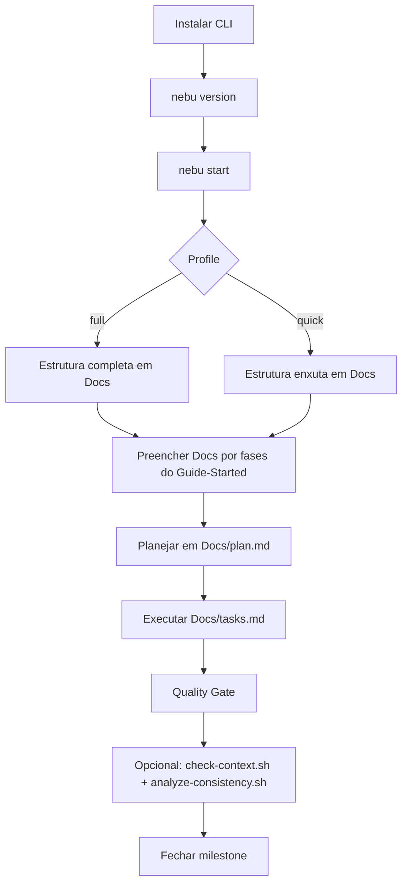
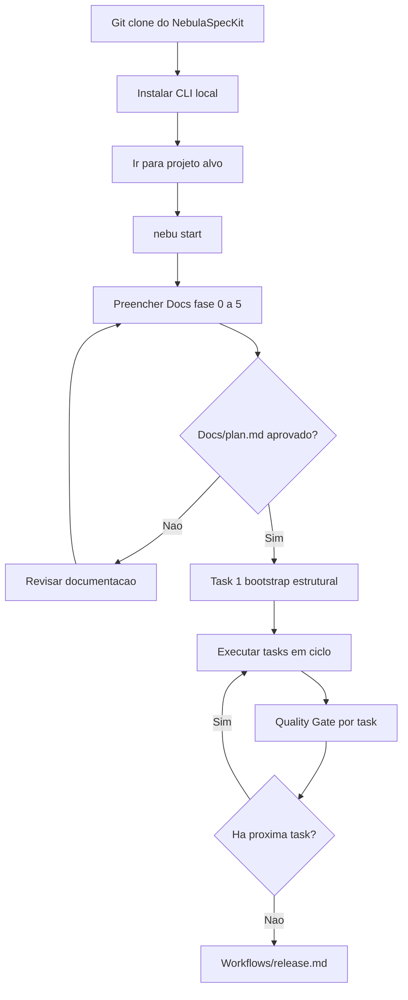

# Guide Started

> Porta de entrada para usuario final do Nébula Spec Kit.

Este guia foca apenas em **como usar o Nébula para criar projetos**.
As regras operacionais complementares ficam em [instructions.md](instructions.md), [Workflows/README.md](Workflows/README.md) e [Quality/README.md](Quality/README.md).

---

## Escolha seu modo de uso

1. **Uso via CLI (recomendado)**: rapido para iniciar no projeto alvo.
2. **Uso via Git Clone**: ideal para quem quer usar o repositorio localmente.

---

## 1) Uso via CLI

### Instalar e validar

```bash
python -m pip install --upgrade pip
python -m pip install nebula-spec-kit-cli
nebu version
```

### Comandos disponiveis atualmente

```bash
nebu start [--profile full|quick] [--root <diretorio>] [--dry-run] [--force]
nebu version
nebu update [--apply] [--yes]
```

### Cenarios praticos

1. Bootstrap padrao no diretorio atual:

```bash
nebu start
```

2. Bootstrap Quick em outro diretorio:

```bash
nebu start --profile quick --root /caminho/do/projeto
```

3. Simulacao sem escrita em disco:

```bash
nebu start --dry-run
```

4. Atualizacao da CLI:

```bash
nebu update
nebu update --apply --yes
```

### Cenarios com scripts `.sh` atuais

Os scripts read-only atuais estao em:

- [Templates/Full/automation/check-context.sh](Templates/Full/automation/check-context.sh)
- [Templates/Full/automation/analyze-consistency.sh](Templates/Full/automation/analyze-consistency.sh)
- [Templates/Quick/automation/check-context.sh](Templates/Quick/automation/check-context.sh)
- [Templates/Quick/automation/analyze-consistency.sh](Templates/Quick/automation/analyze-consistency.sh)

Se voce estiver usando apenas a instalacao via PyPI, clone o repositório para obter esses scripts.

Uso sugerido no seu projeto (a partir de uma copia local do repositório NebulaSpecKit):

```bash
mkdir -p tools
cp /caminho/para/NebulaSpecKit/Templates/Full/automation/*.sh tools/
chmod +x tools/check-context.sh tools/analyze-consistency.sh

# checks de contexto
./tools/check-context.sh --mode ci
./tools/check-context.sh --mode startup
./tools/check-context.sh --mode task --workflow new-feature
./tools/check-context.sh --mode release

# analise de consistencia
./tools/analyze-consistency.sh
```

### Fluxo Mermaid (CLI)



---

## 2) Uso via Git Clone

### Setup local

```bash
git clone https://github.com/MolinariBR/NebulaSpecKit.git
cd NebulaSpecKit
python3 -m venv .venv
. .venv/bin/activate
python -m pip install --upgrade pip
python -m pip install -e ./CLI
```

### Criar projeto com a CLI local

```bash
cd /caminho/do/projeto-root
nebu start
```

### Fluxo Mermaid (Git Clone + Hierarquia do Guide-Started)



---

## 3) Proximo passo obrigatorio para usuario final

Depois de iniciar por CLI ou Git Clone, siga esta ordem:

1. [Manual/README.md](Manual/README.md)
2. [Manual/GitClone.md](Manual/GitClone.md)
3. [Manual/Cli.md](Manual/Cli.md)
4. [Manual/Uso.md](Manual/Uso.md)
5. [Manual/Fluxo.md](Manual/Fluxo.md)
6. [Manual/Prototipagem.md](Manual/Prototipagem.md)

---

## Referencias rapidas

- Guia base: [Guide-Started.md](Guide-Started.md)
- Instrucoes e precedencia: [instructions.md](instructions.md)
- Workflows: [Workflows/README.md](Workflows/README.md)
- Quality: [Quality/README.md](Quality/README.md)
- Templates: [Templates/Full/README.md](Templates/Full/README.md)
