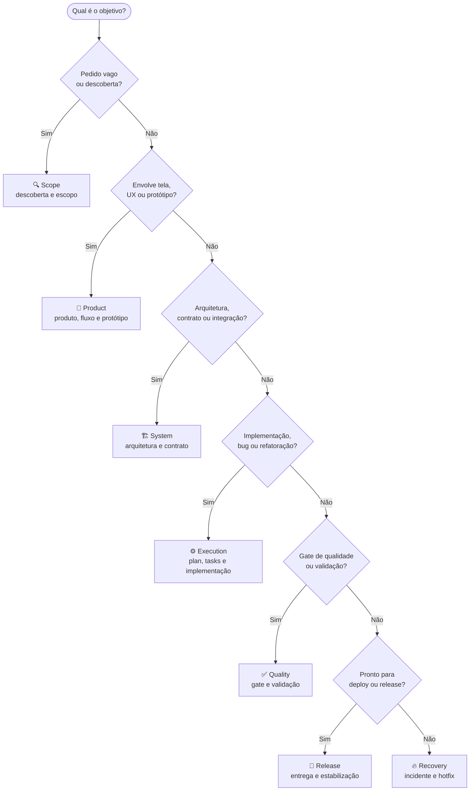
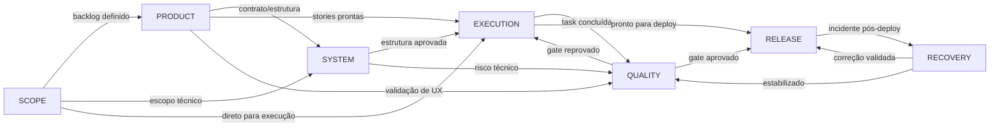

# Execução com Agentes

> Este manual cobre apenas o **delta** de execução com agentes.  
> O fluxo comum está em [Execution.md](Execution.md).

---

## Leitura Obrigatória

| # | Documento | Finalidade |
|---|-----------|------------|
| 1 | [Execution.md](Execution.md) | Fluxo base de execução |
| 2 | [../agents/README.md](../agents/README.md) | Catálogo de agentes |
| 3 | [CreateAgents/Baseline.md](CreateAgents/Baseline.md) | Contexto base de qualquer agente |

---

## Delta do Modo com Agentes

1. Selecionar o agente principal conforme o objetivo da task.
2. Carregar contexto base **e** contexto de especialidade do agente.
3. Declarar o formato de saída esperado **antes** da execução.
4. Quando necessário, fazer handoff para agente complementar.

---

## Escolha Rápida de Agente



---

## Matriz de Papéis

| Agente | Chamar quando | Entrega esperada | Handoff comum |
|--------|---------------|------------------|---------------|
| **Scope** | Pedido vago, descoberta inicial, definição de limite | Escopo aprovado, objetivos mensuráveis, backlog inicial | Product · System · Execution |
| **Product** | Nova tela, mudança de UX/UI, necessidade de protótipo | User stories, páginas e fluxo claros para execução | System · Execution · Quality |
| **System** | Mudança de contrato, integração externa, decisão arquitetural | Arquitetura atualizada, contrato consistente, riscos técnicos | Execution · Quality |
| **Execution** | Implementação, bug fix, refatoração, evolução de módulo | Tasks com evidências, progresso em control, entrega rastreável | Quality · Release |
| **Quality** | Fechamento de task, dúvida de cobertura ou fidelidade | Decisão de gate, evidências, bloqueios objetivos | Execution · Release |
| **Release** | Escopo aprovado no gate e pronto para deploy | Release com checklist, monitoramento e rollback validado | Recovery · Execution |
| **Recovery** | Incidente em produção, hotfix emergencial | Correção validada, estabilização, causa raiz e prevenção | Quality · Release |

---

## Fluxo de Handoff Entre Agentes



### Registro obrigatório em todo handoff

1. O que foi **concluído**.
2. O que ficou **pendente**.
3. Qual agente deve **assumir**.
4. Quais **arquivos** devem ser carregados no próximo ciclo.

---

## Prompt Mínimo

```text
Use o agente: <AgentName>
Objetivo: <objetivo>
Workflow: Workflows/<workflow>.md
Contexto de execução: Docs/plan.md, Docs/tasks.md, Docs/control.md
Saída: plano, execução, evidências, riscos e pendências
```

---

## Checklist — Modo com Agentes

- [ ] Agente principal correto para a demanda
- [ ] Contexto base e contexto especializado carregados
- [ ] Handoff definido quando houver dependência entre papéis
- [ ] Saída registrada em `Docs/tasks.md` e `Docs/control.md`, quando aplicável