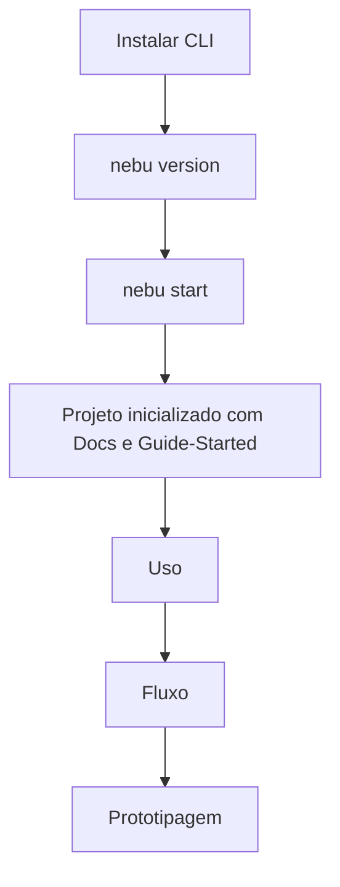

# Guide CLI

Guia de instalação e entrada para quem vai usar o Nébula via pacote CLI publicado.

## Objetivo

Instalar a CLI, iniciar o projeto e encaminhar para os guias de uso completo.

## Instalação

```bash
python -m pip install --upgrade pip
python -m pip install nebula-spec-kit-cli
```

## Comandos disponíveis

```bash
nebu start [--profile full|quick] [--root <diretorio>] [--dry-run] [--force]
nebu submit "mensagem" [--task-id <id>]
nebu version
nebu update [--apply] [--yes]
```

## Primeiro uso

1. Verificar versão:

```bash
nebu version
```

2. Inicializar no projeto alvo:

```bash
cd /caminho/do/projeto-root
nebu start
```

## Fluxo Mermaid (CLI)



## Próximos guias (obrigatório)

1. [Uso.md](Uso.md)
2. [Fluxo.md](Fluxo.md)
3. [Prototipagem.md](Prototipagem.md)
