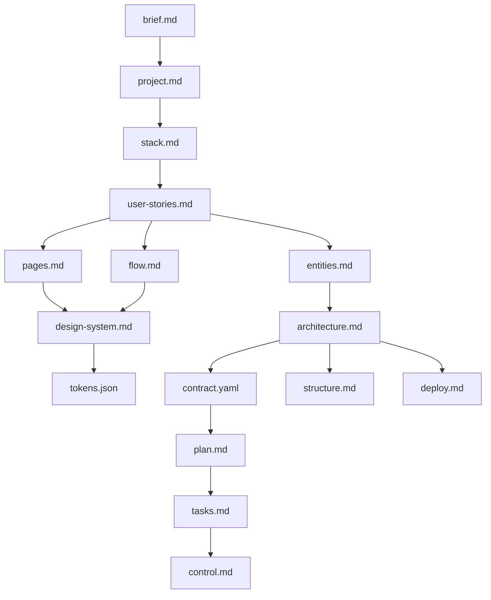

# Guide Fluxo de Documentos

Guia de criação de documentos e hierarquia documental no Nébula.

## Objetivo

Explicar a ordem de criação dos documentos oficiais e como eles se relacionam entre si.

## Ordem de criação recomendada

1. `Docs/brief.md`
2. `Docs/project.md`
3. `Docs/stack.md`
4. `Docs/user-stories.md`
5. `Docs/pages.md`
6. `Docs/flow.md`
7. `Docs/design-system.md`
8. `Docs/tokens.json`
9. `Docs/entities.md`
10. `Docs/architecture.md`
11. `Docs/contract.yaml`
12. `Docs/structure.md`
13. `Docs/deploy.md`
14. `Docs/plan.md`
15. `Docs/tasks.md`
16. `Docs/control.md`

## Hierarquia documental (dependências)

1. Escopo base: `brief.md` -> `project.md` -> `stack.md`.
2. Produto: `user-stories.md` orienta `pages.md` e `flow.md`.
3. UI: `design-system.md` orienta `tokens.json` e `Docs/Prototype/`.
4. Sistema: `entities.md` e `architecture.md` orientam `contract.yaml` e `structure.md`.
5. Operação: `deploy.md` depende de decisões de arquitetura/estrutura.
6. Execução: `plan.md` orienta `tasks.md`; `control.md` registra progresso e evidências.

## Fluxo Mermaid (Criação e Hierarquia)

## Regra prática

1. `Docs/` é a fonte de verdade.
2. `Templates/` é apenas modelo.
3. Não iniciar implementação sem base documental mínima consistente.
