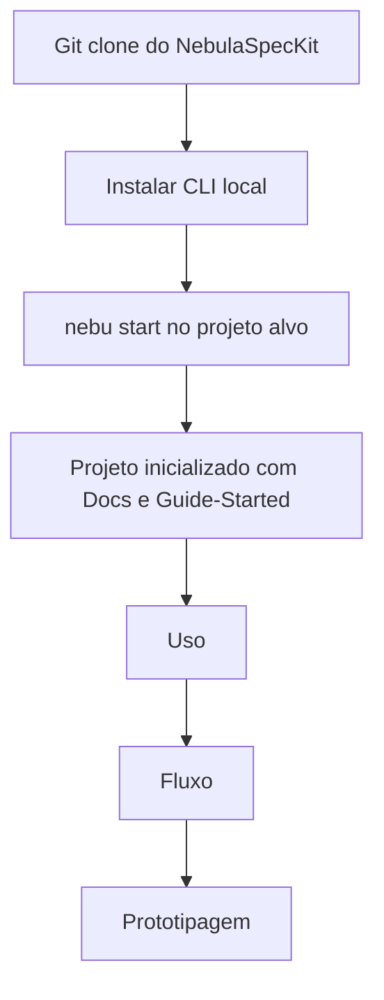

# Guide Git Clone

Guia de instalação e entrada para quem vai usar o Nébula via clone local do repositório.

## Objetivo

Preparar ambiente local, instalar CLI em modo editável e iniciar o projeto alvo.

## Instalação local

```bash
git clone https://github.com/MolinariBR/NebulaSpecKit.git
cd NebulaSpecKit
python3 -m venv .venv
. .venv/bin/activate
python -m pip install --upgrade pip
python -m pip install -e ./CLI
```

## Primeiro uso no projeto alvo

```bash
cd /caminho/do/projeto-root
nebu start
```

## Fluxo Mermaid (Git Clone)



## Próximos guias (obrigatório)

1. [Uso.md](Uso.md)
2. [Fluxo.md](Fluxo.md)
3. [Prototipagem.md](Prototipagem.md)
