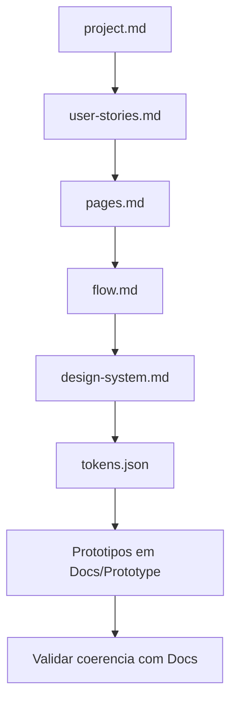

# Guide Prototipagem

Guia para usar o Nébula na criação de protótipos em `Docs/Prototype/`.

## Objetivo

Criar protótipos navegáveis alinhados ao fluxo do produto antes da implementação final.

## Documentos de referência obrigatórios

1. `Docs/project.md`
2. `Docs/user-stories.md` (complemento funcional)
3. `Docs/pages.md`
4. `Docs/flow.md`
5. `Docs/design-system.md`
6. `Docs/tokens.json`

## Processo de prototipagem

1. Ler `project.md` e `user-stories.md` para contexto e comportamento.
2. Definir telas alvo em `pages.md`.
3. Definir jornada em `flow.md`.
4. Aplicar padrão visual de `design-system.md` e `tokens.json`.
5. Criar protótipos HTML em `Docs/Prototype/`.
6. Validar coerência entre protótipo e documentação.

## Estrutura sugerida em `Docs/Prototype/`

1. `index.html` (opcional para navegação entre telas)
2. `pages/` (telas)
3. `assets/` (css/js/imagens de prototipagem)

## Fluxo Mermaid (Prototipagem)

## Critério de pronto

1. Protótipo reflete páginas e fluxo aprovados.
2. Tokens e design system aplicados de forma consistente.
3. Ajustes necessários registrados para próxima task.
