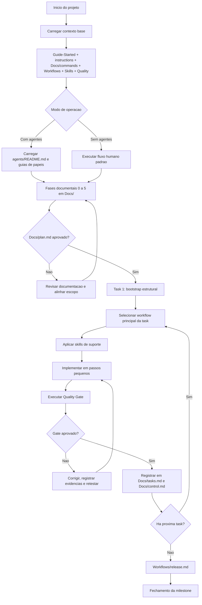

# Guide Uso

> Guia metodológico oficial de uso do Nébula Spec Kit para o usuário final.

## Objetivo

Organizar a construção do projeto em fases sequenciais para reduzir ambiguidade e aumentar previsibilidade de execução.

## Princípio Operacional

```text
Analisar -> Revisar -> Mapear -> Planejar -> Comparar -> Implementar -> Testar -> Validar
```

## Fluxo de uso do Nébula

1. Iniciar estrutura com `nebu start` (ou seguir fluxo Git Clone).
2. Carregar contexto base obrigatório.
3. Definir modo de operação (com agentes ou sem agentes).
4. Preencher documentação em `Docs/` por fases.
5. Aprovar `Docs/plan.md` para liberar execução.
6. Executar tasks curtas, com Quality Gate obrigatório.
7. Registrar evidências em `Docs/tasks.md` e `Docs/control.md`.
8. Fechar milestone no workflow de release.

## Fluxo Mermaid (uso completo)



Notas:
- `Manual/` é guia para dev humano e não integra o contexto mínimo da IA.
- `Templates/` é referência de estrutura; saída oficial sempre em `Docs/`.
- `Docs/commands.md` é camada curta de roteamento e não substitui workflows.

## Regras canônicas

### Artefatos

- Arquivos em `Templates/` são modelos de preenchimento, nunca saída oficial.
- Artefatos oficiais do projeto devem ser salvos em `Docs/`.
- Protótipos HTML devem ser salvos em `Docs/Prototype/`.
- Comandos canônicos de roteamento ficam em `Docs/commands.md`.

### Início da documentação

- A pasta `Docs/` inicia vazia por projeto.
- O fluxo consiste em editar progressivamente os arquivos de `Docs/` usando `Templates/` como modelo.
- Implementação ou refatoração só inicia após a documentação mínima da demanda estar consistente.

## Fases do projeto

### Fase 0 - Descoberta

Captura contexto, motivação e escopo antes de qualquer decisão técnica.

| Papel | Arquivo |
|---|---|
| Modelo | [../Templates/Full/brief.md](../Templates/Full/brief.md) |
| Saída oficial | [../Docs/brief.md](../Docs/brief.md) |

### Fase 1 - Definição do projeto

Define produto, objetivos, restrições e escolhas de stack.

| Papel | Arquivo |
|---|---|
| Modelos | [../Templates/Full/project.md](../Templates/Full/project.md) · [../Templates/Full/stack.md](../Templates/Full/stack.md) |
| Saídas oficiais | [../Docs/project.md](../Docs/project.md) · [../Docs/stack.md](../Docs/stack.md) |

### Fase 2 - Requisitos funcionais

Mapeia comportamentos esperados do sistema na perspectiva do usuário.

| Papel | Arquivo |
|---|---|
| Modelo | [../Templates/Full/user-stories.md](../Templates/Full/user-stories.md) |
| Saída oficial | [../Docs/user-stories.md](../Docs/user-stories.md) |

### Fase 3 - Design de produto

Define experiência visual, navegação e sistema de design da interface.

| Papel | Arquivo |
|---|---|
| Modelos | [../Templates/Full/pages.md](../Templates/Full/pages.md) · [../Templates/Full/flow.md](../Templates/Full/flow.md) · [../Templates/Full/design-system.md](../Templates/Full/design-system.md) · [../Templates/Full/tokens.json](../Templates/Full/tokens.json) |
| Saídas oficiais | [../Docs/pages.md](../Docs/pages.md) · [../Docs/flow.md](../Docs/flow.md) · [../Docs/design-system.md](../Docs/design-system.md) · [../Docs/tokens.json](../Docs/tokens.json) |
| Protótipos | [../Docs/Prototype/README.md](../Docs/Prototype/README.md) |

### Fase 4 - Design de sistema

Define entidades, arquitetura, contratos de API, estrutura de código e estratégia de deploy.

| Papel | Arquivo |
|---|---|
| Modelos | [../Templates/Full/entities.md](../Templates/Full/entities.md) · [../Templates/Full/architecture.md](../Templates/Full/architecture.md) · [../Templates/Full/contract.yaml](../Templates/Full/contract.yaml) · [../Templates/Full/structure.md](../Templates/Full/structure.md) · [../Templates/Full/deploy.md](../Templates/Full/deploy.md) |
| Saídas oficiais | [../Docs/entities.md](../Docs/entities.md) · [../Docs/architecture.md](../Docs/architecture.md) · [../Docs/contract.yaml](../Docs/contract.yaml) · [../Docs/structure.md](../Docs/structure.md) · [../Docs/deploy.md](../Docs/deploy.md) |

### Fase 5 - Planejamento de implementação

Estrutura plano de execução, tasks e controle de progresso.

| Papel | Arquivo |
|---|---|
| Modelos | [../Templates/Full/plan.md](../Templates/Full/plan.md) · [../Templates/Full/tasks.md](../Templates/Full/tasks.md) · [../Templates/Full/control.md](../Templates/Full/control.md) |
| Saídas oficiais | [../Docs/plan.md](../Docs/plan.md) · [../Docs/tasks.md](../Docs/tasks.md) · [../Docs/control.md](../Docs/control.md) |

## Mapeamento de fases de execução

As fases documentais se traduzem em quatro fases de execução no `plan/tasks`:

| Fase | Escopo |
|---|---|
| FASE-01 | Consolidação documental inicial (Fase 0 -> Fase 3) |
| FASE-02 | Modelagem técnica e preparo de execução (Fase 4 + plano detalhado) |
| FASE-03 | Implementação ou refatoração por tasks com validações intermediárias |
| FASE-04 | Estabilização final, Quality Gate e fechamento de milestone |

## Política de execução por task

### Marco obrigatório de início

- A primeira task deve ser de bootstrap estrutural.
- A task de bootstrap cria diretórios e arquivos previstos.
- A partir da task seguinte, o fluxo opera em modo edição.

### Regras por task

- Cada task concluída gera exatamente 1 commit.
- Apenas tasks com política `bootstrap_estrutural` podem criar diretórios e arquivos.
- Tasks com política `edicao` não podem criar novos caminhos.
- Se um arquivo esperado não existir durante task de edição, abrir task de ajuste estrutural.
- Toda task deve registrar hash do commit e arquivos tocados em [../Docs/tasks.md](../Docs/tasks.md).
- Toda task deve registrar status do Quality Gate e evidências mínimas de validação.

## Dependências recomendadas

Ordem de consistência entre artefatos:

- [../Docs/contract.yaml](../Docs/contract.yaml) depende de [../Docs/entities.md](../Docs/entities.md) e [../Docs/architecture.md](../Docs/architecture.md).
- [../Docs/tasks.md](../Docs/tasks.md) depende de [../Docs/plan.md](../Docs/plan.md).
- [../Docs/tokens.json](../Docs/tokens.json) depende de [../Docs/design-system.md](../Docs/design-system.md).
- [../Docs/design-system.md](../Docs/design-system.md) depende de referência validada em [../Docs/Prototype/README.md](../Docs/Prototype/README.md), quando houver interface.
- Nenhuma task pode ser concluída sem passar no Quality Gate de [../Quality/validation-rules.md](../Quality/validation-rules.md).

## Regra de precedência

Em caso de conflito entre fontes, a ordem de autoridade é:

1. `instructions.md` (raiz operacional).
2. `Docs/contract.yaml` (contrato vigente).
3. Documento-fonte do domínio em `Docs/`.
4. `Docs/plan.md` e `Docs/tasks.md`.
5. Workflow principal em `Workflows/*.md`.
6. `Quality/validation-rules.md` e regras de qualidade aplicáveis.
7. Implementação atual.

Esta seção espelha a precedência canônica definida em [../instructions.md](../instructions.md).

## Pilares transversais

### Qualidade

| Arquivo | Conteúdo |
|---|---|
| [../Quality/README.md](../Quality/README.md) | Visão geral do pilar |
| [../Quality/validation-rules.md](../Quality/validation-rules.md) | Gate obrigatório por task |
| [../Quality/realistic-tests.md](../Quality/realistic-tests.md) | Testes realistas |
| [../Quality/anti-mock.md](../Quality/anti-mock.md) | Política anti-mock |
| [../Quality/clean-rules.md](../Quality/clean-rules.md) | Regras de código limpo |
| [../Quality/structure-rules.md](../Quality/structure-rules.md) | Regras estruturais de arquivo e módulo |
| [../Quality/metrics.md](../Quality/metrics.md) | Métricas e bandas de risco |
| [../Quality/review-checklist.md](../Quality/review-checklist.md) | Checklist de revisão |
| [../Quality/dependencies.md](../Quality/dependencies.md) | Dependências e compatibilidade |
| [../Quality/execution-policy.md](../Quality/execution-policy.md) | Execução por task e controle de escopo |

### Manual operacional

| Categoria | Arquivos |
|---|---|
| Navegação | [README.md](README.md) |
| Guias de entrada | [Cli.md](Cli.md) · [GitClone.md](GitClone.md) · [Fluxo.md](Fluxo.md) · [Prototipagem.md](Prototipagem.md) |
| Execução | [Execution.md](Execution.md) · [Agents.md](Agents.md) · [NoAgents.md](NoAgents.md) |
| Cenários | [Scenarios-Base.md](Scenarios-Base.md) · [Scenarios-Agents.md](Scenarios-Agents.md) · [Scenarios-NoAgents.md](Scenarios-NoAgents.md) |
| Componentes | [Components-Base.md](Components-Base.md) · [Skills.md](Skills.md) · [Workflows.md](Workflows.md) · [Quality.md](Quality.md) · [Templates.md](Templates.md) |
| Criação de agentes | [CreateAgents/README.md](CreateAgents/README.md) · [CreateAgents/Baseline.md](CreateAgents/Baseline.md) · [CreateAgents/Copilot.md](CreateAgents/Copilot.md) · [CreateAgents/Cursor.md](CreateAgents/Cursor.md) · [CreateAgents/Antigravity.md](CreateAgents/Antigravity.md) · [CreateAgents/Windsurf.md](CreateAgents/Windsurf.md) · [CreateAgents/Trae.md](CreateAgents/Trae.md) · [CreateAgents/Claude.md](CreateAgents/Claude.md) · [CreateAgents/OpenCode.md](CreateAgents/OpenCode.md) · [CreateAgents/Zed.md](CreateAgents/Zed.md) |

## Entradas e saídas por task

1. Entradas mínimas: `Docs/plan.md`, `Docs/tasks.md`, `Docs/control.md`.
2. Saída mínima: evidência da execução, gate aprovado e registro atualizado em `Docs/control.md`.
3. Fechamento de milestone: [../Workflows/release.md](../Workflows/release.md).
