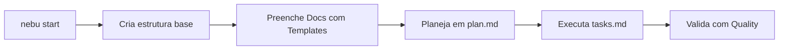

```text
           _   __     __          __         _____                    __ __ _ __
          / | / /__  / /_  __  __/ /___ _   / ___/____  ___  _____   / //_/(_) /_
         /  |/ / _ \/ __ \/ / / / / __ `/   \__ \/ __ \/ _ \/ ___/  / ,<  / / __/
        / /|  /  __/ /_/ / /_/ / / /_/ /   ___/ / /_/ /  __/ /__   / /| |/ / /_
       /_/ |_|\___/_.___/\__,_/_/\__,_/   /____/ .___/\___/\___/  /_/ |_/_/\__/
                                              /_/
```

- Autor: Maurício Molinari
- Licença: MIT
- Site: https://nebulaweb.vercel.app/
- Versão: 1.0.3
- Versão CLI: 0.1.0
- Última atualização: 2026-04-13

# Nébula Spec Kit

Framework de governança documental para projetos reais, com execução por tasks,
validação técnica e suporte a agentes de IA.

---

## O que é o Nébula

O Nébula padroniza o ciclo completo de documentação de produto e engenharia:

1. Definição do escopo e contexto.
2. Estruturação de documentos oficiais em `Docs/`.
3. Execução guiada por `plan.md` e `tasks.md`.
4. Validação com gates de qualidade.

Objetivo: reduzir improviso, aumentar rastreabilidade e manter previsibilidade.

---

## Instalação

### Cenário 1: Instalação fácil com CLI (recomendado)

```bash
python -m pip install --upgrade pip
python -m pip install nebula-spec-kit-cli
cd /caminho/do/projeto-root
nebu start
```

### Cenário 2: Instalação via git clone

```bash
git clone https://github.com/MolinariBR/NebulaSpecKit.git
cd NebulaSpecKit
python3 -m venv .venv
. .venv/bin/activate
python -m pip install --upgrade pip
python -m pip install -e ./CLI

cd /caminho/do/projeto-root
nebu start
```

## Guias completos para usuário final

Depois da instalação, siga por um destes guias:

1. [Manual/Cli.md](Manual/Cli.md)
2. [Manual/GitClone.md](Manual/GitClone.md)

Após concluir o guia de instalação escolhido, avance nesta ordem:

1. [Manual/Uso.md](Manual/Uso.md)
2. [Manual/Fluxo.md](Manual/Fluxo.md)
3. [Manual/Prototipagem.md](Manual/Prototipagem.md)

---

## Fluxo de uso (resumo)



---

## O que o `nebu start` cria

O comando cria estrutura física mínima no projeto alvo.

```text
projeto-root/
├── .nebula/
├── Guide-Started.md
└── Docs/
    ├── Prototype/
    ├── brief.md
    ├── project.md
    ├── stack.md
    ├── user-stories.md
    ├── pages.md
    ├── flow.md
    ├── design-system.md
    ├── tokens.json
    ├── entities.md
    ├── architecture.md
    ├── contract.yaml
    ├── structure.md
    ├── deploy.md
    ├── plan.md
    ├── tasks.md
    └── control.md
```

Observações:
- Os arquivos em `Docs/` são criados vazios.
- O conteúdo é preenchido depois, usando templates e workflow do Nébula.

---

## Onde cada parte vive

- Porta de entrada (usuario final): [Guide-Started.md](Guide-Started.md)
- Método central: [Guide-Started.md](Guide-Started.md)
- Instruções e precedência: [instructions.md](instructions.md)
- Manual operacional completo: [Manual/README.md](Manual/README.md)
- Workflows de execução: [Workflows/README.md](Workflows/README.md)
- Regras de qualidade: [Quality/README.md](Quality/README.md)
- Templates oficiais: [Templates/Full/README.md](Templates/Full/README.md)
- Agentes e contratos: [agents/README.md](agents/README.md)
- Artefatos oficiais do projeto: [Docs/README.md](Docs/README.md)

---

## Comandos da CLI

```bash
nebu start
nebu submit "commit message"
nebu version
nebu update
```

---

## Princípios

- Fidelidade entre documentação e entrega.
- Rastreabilidade de decisões e mudanças.
- Consistência entre dev humano e IA.
- Governança com qualidade desde o início.

---

> **Nota:** Este framework recentemente recebeu atualizações relativas à automação (CLI e Pre-Commits). Veja o escopo no [Relatório de Eficiência (Docs/efficiency-improvements.md)](Docs/efficiency-improvements.md).
